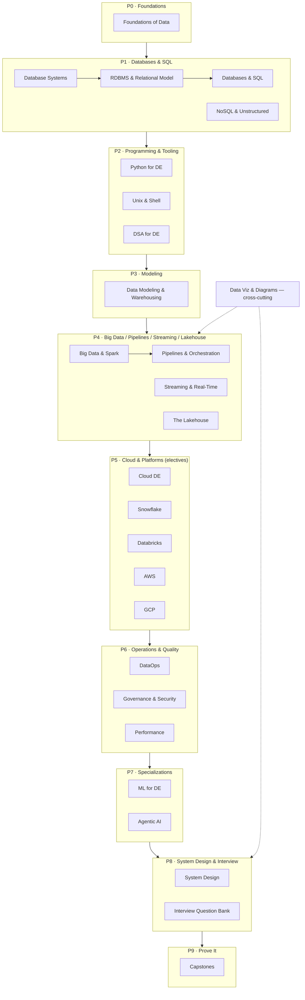
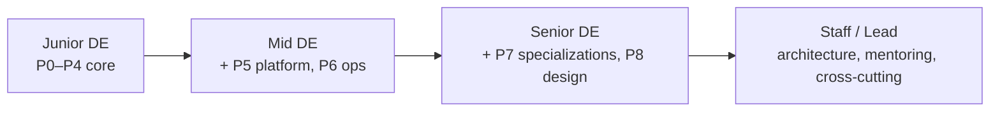
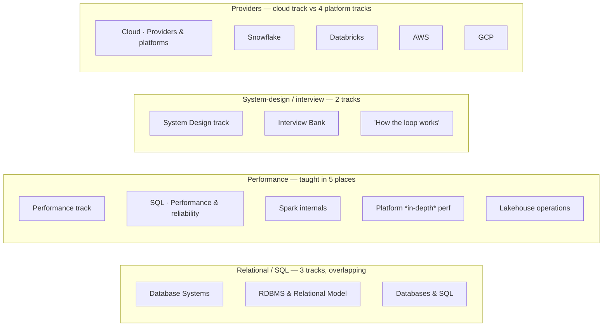

# The Datalith Gold Standard

This is the definition of "done" for every lesson, track, and diagram in Datalith.
The goal is simple and ambitious: a motivated learner who finishes this curriculum should be able
to do the job of a strong, working data engineer. Nothing here is decoration — every element earns
its place by making a concept **clearer, more memorable, or more job-ready**.

If a change does not move a lesson toward that bar, it does not ship.

---

## 1. What every lesson must have

A gold-standard lesson is not a definition dump. It teaches the way a great mentor teaches —
motivation first, then the idea, then proof, then practice.

1. **Concept** — plain-English explanation that starts with *why this exists / what problem it
   solves*, then builds the mental model. No unexplained jargon; every term is introduced before
   it is used.
2. **Worked example** — concrete, runnable, realistic. Real column names, real numbers, the kind of
   thing you'd actually see on the job — never `foo`/`bar`.
3. **Key points** — the handful of things you must remember, each one sentence, each independently true.
4. **Quiz** — checks understanding, not recall of trivia; every wrong answer is plausible and the
   explanation says *why*.
5. **Practice exercises** — with full solutions that teach, not just answer. The solution explains
   the reasoning so a stuck learner becomes an unstuck one.
6. **At least one diagram** (see §2) — every teaching lesson gets a visual. Reference/Q&A pages
   (interview banks) get a representative anchor diagram where one adds value.
7. **A deep-dive tutorial** (`content/lessons/<id>.md`) for any topic with real depth — internals,
   edge cases, "go deeper" material beyond the lesson card.

A lesson is judged by one test: **could the learner now explain this to someone else, and use it on
the job?** If not, it isn't gold standard yet.

---

## 2. Diagrams — maximize coverage, never ship a broken one

> **Principle (added at the user's direction): use as many diagrams as needed to make every topic
> clear. There is no cap on diagram count. If a second or third diagram makes a concept easier to
> grasp — a flow, an architecture, a before/after, a comparison — add it.** A topic that has an
> architecture or a flow *deserves* a diagram of that architecture or flow; missing one is a defect,
> not a stylistic choice.

Diagrams are a primary teaching tool here, not an afterthought. Concretely:

- **Every teaching lesson has at least one diagram.** Architectures, pipelines, flows, state
  machines, comparisons, and "how it really works" internals should each be drawn. Prefer adding a
  diagram over adding another paragraph when the idea is spatial or sequential.
- **More is allowed and encouraged.** Use the inline `@@diagram:<key>` syntax in deep-dive markdown
  to place additional diagrams exactly where they help, beyond the lesson's primary curriculum diagram.
- **A broken diagram is worse than no diagram.** Reversed arrows, arrowheads overshooting into the
  next box, floating connectors, text spilling outside its box, overlapping shapes, or anything
  misaligned is a hard defect.

### Diagram quality bar (every diagram must pass)

- **Correct semantics** — arrows point the right way; the picture matches the prose; labels are accurate.
- **Clean geometry** — no overshoot, no floating lines, no overlaps, nothing clipped by the viewBox;
  connectors start and end exactly on box edges.
- **Readable** — legible font sizes, enough contrast, consistent colors with meaning (e.g. green =
  good/result, red = bad/quarantine, amber = caution/coordination, blue = primary/compute).
- **Self-contained & consistent** — uses the shared pack helpers (`box`, `t`, `ln`, `arrowR/L/U/D`,
  `path`, `svg`) and the shared color tokens, so all diagrams share one visual language.
- **Visually verified** — every diagram is rendered to an image and *looked at* before it ships, not
  just reasoned about in code. (Render the SVG to PNG and inspect it; a contact sheet works for bulk
  review.) This is mandatory — the eye catches what code review misses.

---

## 3. Track & curriculum standards

- **Learning-path order.** Tracks are grouped into **phases** (see §5 for the full map) so each phase
  builds on the last: **Foundations → Databases & SQL → Programming & Tooling → Modeling & Warehousing →
  Big Data · Pipelines · Streaming · Lakehouse → Cloud & Platforms (electives) → Operations & Quality →
  Specializations (ML / Agentic) → System Design & Interview → Prove It (Capstones)**, with
  Data Visualization & Diagrams as a cross-cutting communication skill. A topic never depends on
  something taught later. _(This supersedes the old flat 21-track list; the curriculum is now 27 tracks —
  see §5–§9 for the current map, the sanity-check, and what's being added.)_
- **No dead ends.** Every internal link, diagram key, deep-dive reference, and cheat-sheet resolves.
- **Navigation just works.** Moving between lessons lands the reader at the **top** of the new lesson;
  next/prev never strands them mid-page.
- **Interview-ready.** Each track ends with an interview check, and the interview bank reflects what
  real companies actually ask (2026).
- **Capstones prove it.** End-to-end projects that actually run, using real tools the way a job would.

---

## 4. The verification ritual (do this before claiming "done")

1. **JSON validity** — `curriculum.json` parses; no trailing commas, no dangling fields.
2. **Reference integrity** — every `"diagram"` key and every `@@diagram:` key exists in a loaded pack;
   every deep-dive `id.md` referenced exists.
3. **Diagram render check** — render and *view* changed diagrams; confirm geometry and semantics.
4. **Wiring** — every diagram pack is included in `index.html`; cache-busting `?v=` bumped on change.
5. **Navigation** — open a lesson, scroll down, click next: it opens at the top.
6. **Order** — track and lesson order matches the learning path above.

Only when all six pass is the work gold standard.

---

## 5. Curriculum architecture — the phase model (mentor reorganization)

The curriculum is now **27 tracks, 542 lessons, ~109 hours**. That is a serious body of work, but a
flat list of 27 peer tracks is overwhelming and hides the path. The fix is not to cut the depth — it
is to **group tracks into phases** with a clear spine and mark what's **core** vs **elective**.

| Phase | Tracks | Purpose | Core/Elective |
|---|---|---|---|
| **P0 · Foundations** | Foundations of Data | The vocabulary and mental models everything builds on | Core |
| **P1 · Databases & SQL** | Database Systems (DBMS) · RDBMS & the Relational Model · Databases & SQL · NoSQL | How data is stored and queried; SQL to fluency | Core |
| **P2 · Programming & Tooling** | Python for DE · Unix & Shell · DSA for DE | The languages/tools you build pipelines with | Core |
| **P3 · Modeling & Warehousing** | Data Modeling & Warehousing | Turn requirements into schemas that scale | Core |
| **P4 · Big Data · Pipelines · Streaming · Lakehouse** | Big Data & Spark · Pipelines & Orchestration · Streaming & Real-Time · The Lakehouse | The heart of the job: move and transform data at scale | Core |
| **P5 · Cloud & Platforms** | Cloud DE · Snowflake · Databricks · AWS · GCP | Where it all runs — **pick your stack, don't do all four** | Elective |
| **P6 · Operations & Quality** | DataOps · Governance & Security · Performance | Making it production-grade, trustworthy, fast | Core |
| **P7 · Specializations** | ML for DE · Agentic AI for DE | The 2026 edge — AI/ML data work | Elective |
| **P8 · System Design & Interview** | System Design · Interview Question Bank (50LPA+) | Design method + the real question bank | Core |
| **P9 · Prove It** | Capstone Projects | End-to-end builds that demonstrate the whole path | Core |
| **Cross-cutting** | Data Visualization & Diagrams | A communication skill used from P4 onward, not a phase | Core |

**The phase map:**

**Map phases to hiring levels** (so a learner knows when they're "ready"):

---

## 6. Sanity-check findings — trim, merge, rewrite

A hard look at the 27 tracks surfaces real overlaps and a few smells. None of this is "bad content";
it's **the same idea taught in several places** and a few structural rough edges.

### 6.1 Redundancy & consolidation

- **DBMS + RDBMS + Databases & SQL** (49 lessons) overlap on the relational model. Give each a clean
  lane and cut the duplicated relational-model lessons: **DBMS = how a database works internally**
  (storage, transactions, indexing); **RDBMS = the relational model + schema design** (feeds Modeling);
  **Databases & SQL = the SQL language**. Strong candidate to **merge DBMS+RDBMS** into one
  "Database Systems & the Relational Model" track (two clean halves) to reduce track sprawl.
- **Performance is taught in five places.** Keep engine-specific tuning inside each engine's track and
  reframe the standalone **Performance** track as a short cross-cutting *"performance mindset"* capstone
  (methodology + how to read a query plan) rather than re-teaching indexing/partitioning a fifth time.
- **System Design vs Interview Bank** both cover DE design interviews + behavioral. Split cleanly:
  **System Design = the method + distributed-systems fundamentals + worked designs** (teaching);
  **Interview Bank = the question bank + company playbooks** (reference). Cross-link, don't re-teach the loop.
- **Cloud "Providers & platforms" (5)** duplicates the four deep platform tracks. Trim it to a
  provider-agnostic *"how to choose a stack"* chooser; the deep content lives only in the platform tracks.

### 6.2 Module-level fixes

- **Confusing near-duplicate module names.** Big Data & Spark has both *"Spark internals & the ecosystem"*
  and *"Spark internals & operations"* — rename to **Spark internals / Spark ecosystem / Running Spark
  in production**. Data Modeling's *"Modeling approaches"* + *"More modeling patterns"* are vague — rename
  to the concrete patterns they teach.
- **Single-lesson modules are a smell** (Foundations *Data quality foundations*, Streaming *Build a
  streaming pipeline*, Lakehouse *Lakehouse operations*, Cloud *Cost & operations*, DataOps *Monitoring &
  on-call*, Governance *Classification & lifecycle*). Either **expand to 2–3 lessons** or **merge into a
  sibling** — a module of one is either under-built or mis-grouped.
- **"Data Vault 2.0" (5 lessons)** inside core Data Modeling is advanced/niche for the core path —
  trim to 2–3 essential lessons or move to an advanced/elective module.
- **Python for DE (60 lessons / 14 modules)** is ~2× the next-biggest core track. Consider splitting into
  **Python for DE — core** and **Python data libraries** (NumPy/pandas/Arrow/Polars/DuckDB/Dask).
- **Per-track "Interview prep" (1 lesson × ~20 tracks)** is fine as a recap but rename to
  **"Recap & interview angles"** so it reads as a track wrap-up, not a duplicate of the Interview Bank.

### 6.3 Documentation-freshness defects (found during this review)

- **§3's learning path was stale** (listed 21 tracks) — fixed above to the phase model.
- **`SYLLABUS.md` header is badly stale**: *"17 tracks · 250 lessons"* vs the real **27 tracks · 542
  lessons**. Regenerate it from `curriculum.json` (it should be a generated artifact, never hand-counted).
- **`README.md` stats** should be re-derived the same way. **Action: add a tiny generator script** so
  these numbers can never drift again.

---

## 7. What to add — 2026 job-readiness gaps

Mentor's view of what a strong 2026 DE is expected to know that the curriculum under-covers today:

```mermaid
flowchart TB
  ADD["2026 additions"]
  ADD --> Q["Data Quality & Contracts<br/>schema registry · contract tests · DQ framework (GE/dbt tests)"]
  ADD --> OBS["Observability & Lineage<br/>freshness/volume/schema monitors · OpenLineage · column-level lineage"]
  ADD --> ARCH["Architecture patterns<br/>Medallion · Lambda/Kappa · Data Mesh · Data Products"]
  ADD --> AI["AI data engineering<br/>embeddings · vector DBs · RAG pipelines · LLM eval datasets"]
  ADD --> FIN["FinOps for data<br/>cost models · tagging · storage tiering · query-cost governance"]
  ADD --> IAC["IaC & containers<br/>Terraform for data · Docker/K8s · Spark-on-K8s · Airflow-on-K8s"]
  ADD --> SEC["Security, deep<br/>encryption · secrets · tokenization · row/column security · PII"]
  ADD --> CDC["Ingestion & CDC, deep<br/>Debezium/Kafka Connect · log vs query CDC · backfill reconciliation"]
  ADD --> SOFT["Working as a DE<br/>design docs · stakeholder comms · SLAs · on-call · career kit"]
```

| Addition | Where it lands | Why it matters in 2026 |
|---|---|---|
| **Data Quality & Contracts** | new module in Governance or Pipelines | Data contracts + tested quality are now table-stakes; asked in interviews |
| **Observability & Lineage** | new module in DataOps | "Is the data fresh/correct?" is a first-class production concern |
| **Architecture patterns** | consolidate into System Design | Medallion/Lambda/Kappa/Data Mesh are scattered; learners need one map |
| **AI data engineering (RAG/vector/embeddings)** | expand Agentic AI + ML for DE | The fastest-growing DE work; pipelines that feed LLMs |
| **FinOps / cost engineering** | new module in Performance or Cloud | Cloud bills are a DE responsibility; cost is a design constraint |
| **IaC & containers** | new module in DataOps (cheat sheets already exist) | Terraform/K8s are how modern platforms are shipped |
| **Security, deep** | expand Governance | Encryption, secrets, tokenization, fine-grained access are must-knows |
| **Ingestion & CDC, deep** | expand Pipelines/Streaming | CDC (Debezium) is the backbone of modern ingestion |
| **Working as a DE + career kit** | new module in DataOps + Interview Bank | Design docs, comms, SLAs, resume/portfolio/negotiation move careers |

Every new lesson still ships at the **§1 bar** (concept → worked example → key points → quiz → practice
→ diagram → deep-dive) and every new architecture/flow **gets a diagram** (§2, no cap).

---

## 8. Implementation plan — do it safely, in this order

Reorganizing 542 lessons in a 3.9 MB `curriculum.json` is surgery. Sequence from lowest-risk (additive)
to highest-risk (moves/merges), and run the **§4 verification ritual after every step**.

1. **Additive first (safe).** Author the §7 additions as new modules/lessons + diagrams — this only
   grows the file, never breaks existing ids or links.
2. **Rename modules (safe).** Fix the confusing/near-duplicate module names and rename the per-track
   "Interview prep" recaps. Titles only; ids and lessons untouched.
3. **Merge single-lesson modules (low risk).** Fold or expand each one-lesson module.
4. **De-duplicate content (medium risk).** Remove the repeated relational-model and performance lessons;
   replace with cross-links. Verify no deep-dive/diagram/cheat link breaks.
5. **Introduce the phase grouping (medium risk).** Add an explicit `phase` field per track (or a
   phase index) and render the grouped map in the app's home/sidebar — navigation, not content.
6. **Track merges last (highest risk).** Only if desired: merge DBMS+RDBMS; split Python. Do these as
   isolated, individually-verified operations with a backup of `curriculum.json` first.
7. **Regenerate the docs.** Rebuild `SYLLABUS.md`/`README.md` stats from `curriculum.json` via a script
   so they can never go stale again.

Each step is independently shippable; the app stays fully working between steps.

---

_Maintained as the single source of truth for quality. When in doubt, optimize for the learner's
understanding — clarity over cleverness, a picture over a paragraph, and never ship something broken._
