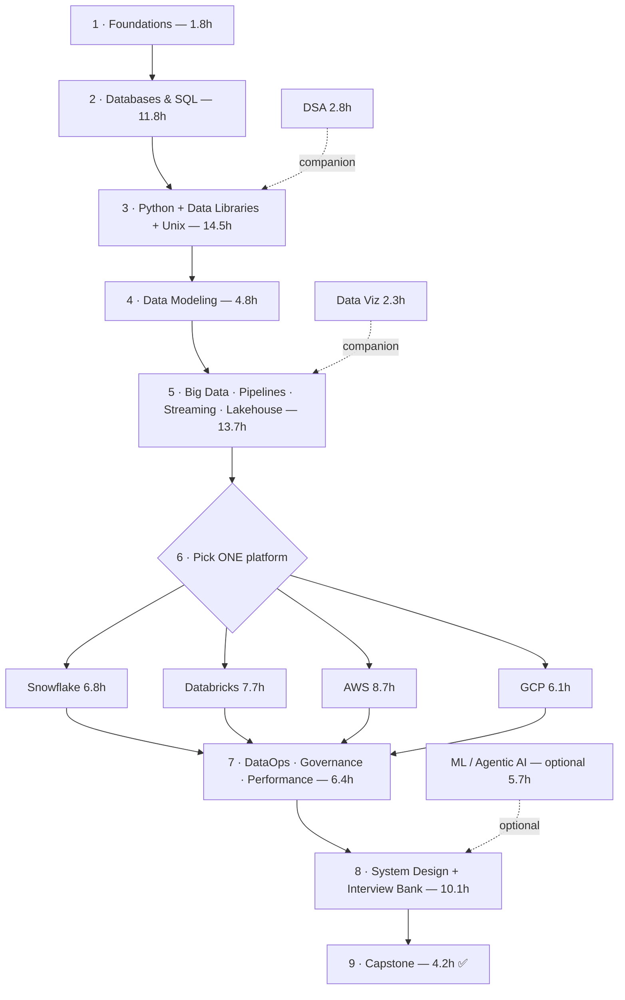

# The Datalith Golden Path

**One ordered route from zero to job-ready — ~83 hours of core content.** Follow it top to bottom; branch only where marked.

Datalith is 28 tracks and 546 lessons — that's a *library*, not a to-do list. Nobody should read all of it in order: about half the volume is **elective** (you learn *one* cloud platform, not four; ML/Agentic only if your role needs them). This page is the **single flow** — the exact order to learn in, the one place you choose, and the companions you weave in. Do this and you'll have covered everything a strong 2026 data engineer needs.

## The path at a glance

## Follow this order

**1. Foundations of Data — 1.8h.** The vocabulary and mental models everything builds on: the role, data shapes, file formats, OLTP vs OLAP, the data lifecycle, distributed-systems basics, data quality. Don't skip — every later track assumes this.

**2. Databases & SQL — 11.8h.** DBMS (how database systems work internally) → RDBMS (the relational model & design) → **Databases & SQL** (the language, to fluency: joins, window functions, transactions, indexing) → NoSQL. SQL is the single most-used skill on the job; over-invest here.

**3. Python + Data Libraries + Unix — 14.5h.** Python for Data Engineering (the language + engineering practices) → Python Data Libraries (NumPy, pandas, Arrow, Polars, DuckDB, plus SQLAlchemy/Pydantic/ingestion) → Unix & Shell. This is what you *build* pipelines with.

**4. Data Modeling & Warehousing — 4.8h.** Turn requirements into schemas that scale: dimensional modeling, star schemas, SCD, grain, the semantic layer. The skill that separates senior from junior.

**5. Big Data · Pipelines · Streaming · Lakehouse — 13.7h.** The heart of the job: Spark (how it works + internals), building & orchestrating reliable pipelines, real-time streaming (Kafka, watermarks, exactly-once), and the lakehouse (Delta/Iceberg, medallion). Do these four in order.

**6. Pick ONE cloud platform — ~7h. ⟵ the branch.** Everything runs in the cloud, but you only need to go deep on **one** stack — the one your target jobs use. Learn Cloud Data Engineering (provider-agnostic, 2.9h) first, then pick one below. You can skim a second platform later.

| Platform | Hours | Choose it if… |
|---|---|---|
| **Databricks** | 7.7h | Target shops use Spark/lakehouse; you like notebooks + Delta |
| **Snowflake** | 6.8h | Warehouse-first analytics shops; SQL-centric roles |
| **AWS** | 8.7h | The most common cloud; broad DE roles (S3/Glue/Redshift/Athena) |
| **GCP** | 6.1h | BigQuery/Dataflow shops |

**7. Operations & Quality — 6.4h.** DataOps (Git, CI/CD, IaC, containers, observability, data contracts — and the **DE craft & career** module), Governance & Security, and Performance. This is what makes you *production-grade*, not just able to write a query.

**8. System Design + Interview Bank — 10.1h.** The design method + distributed-systems fundamentals + worked designs, then the full **Interview Question Bank** (16 company playbooks + round banks). Start this ~3–4 weeks before interviewing.

**9. Capstone — 4.2h. ✅** Build end-to-end projects that prove the whole path. This is your portfolio.

## Companions — weave in, don't block on

- **DSA for Data Engineering (2.8h)** — do it alongside Python (step 3), then revisit right before interviews.
- **Data Visualization & Diagrams (2.3h)** — from Big Data (step 5) onward; you'll draw architectures constantly (and in interviews).
- **Cheat sheets** (📄 top bar) — one-page references per track; skim before interviews. Not lessons to "complete."

## Optional specializations

- **Machine Learning for DE (3.1h)** and **Agentic AI for DE (2.6h)** — take these if your target role touches ML pipelines, feature stores, or RAG/LLM data work. Otherwise skip for now.

## Role-based routes (if you're optimizing for a specific job)

- **Analytics Engineer** → heavy on SQL, Data Modeling, dbt (in Pipelines), one **warehouse** (Snowflake or BigQuery), Data Viz. Lighter on Spark/streaming.
- **Big Data / Spark Engineer** → heavy on Big Data & Spark, **Databricks**, Streaming, Performance.
- **Streaming / Real-time Engineer** → heavy on Streaming (Kafka, Flink concepts), one platform's streaming stack, System Design.
- **Cloud / Platform Engineer** → heavy on Cloud, one platform **deep**, DataOps (IaC, CI/CD, containers).
- **Everyone, always** → Foundations, SQL, Python, Data Modeling, System Design, Interview Bank.

## How to use it

- A lesson is ~10–15 min. The **~83h core ≈ 8–10 weeks** at ~1–1.5h/day.
- **Do the exercises** — that's where it sticks. Mark lessons complete to watch the progress ring fill.
- End each track with its **"Interview prep"** recap; it's the track on one screen.
- Stuck on "what next?" — just follow the phase order on the home page. That *is* this path.

---

_This is the recommended route, not a cage — skip ahead where you're already strong, and go deep where your target role demands it. The goal is a job-ready data engineer, by the shortest honest path._
