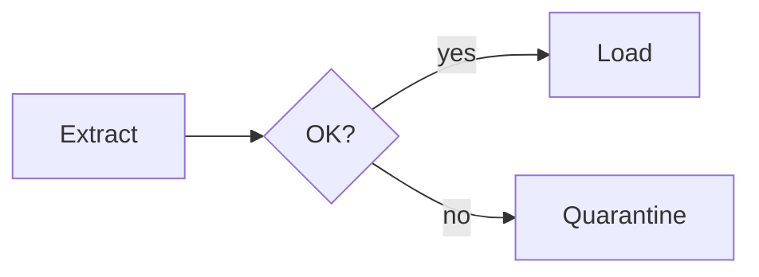

# Data Visualization & Diagrams — quick reference

The one-screen recap of the track. Depth is in the lessons &amp; "Go deeper" chapters.

## Pick the chart from the question

| The question | Chart |
|---|---|
| Compare values across categories | **Bar** (sorted, zero baseline) |
| How does it change over time? | **Line** (area for volume) |
| What's the spread / shape? | **Histogram · box · violin** |
| Are two variables related? | **Scatter** (+ trend line) |
| What's the share of a whole? | **100% stacked bar · treemap** |
| Drop-off through steps? | **Funnel** |
| Flow between stages? | **Sankey** (width = volume) |
| How was a total built up/down? | **Waterfall** |
| One headline metric? | **Big number** |

@@diagram:dv-choose

## Chart types at a glance

- **Bar** — compare categories; **sort by value**, **start at zero**.
- **Line** — change over ordered time; the slope is the rate of change.
- **Histogram** — shape of one variable; tune bin width.
- **Box plot** — median, IQR, whiskers, outliers; great for comparing groups.
- **Violin** — full density; reveals **bimodality a box can't show**.
- **ECDF** — read percentiles (p50/p95/**p99**) straight off the curve.
- **Scatter** — correlation of two numerics (association, **not causation**).
- **Bubble** — scatter + size = a third numeric.
- **Heatmap** — a matrix of values; diverging palette centered at 0.
- **Stacked bar / treemap** — parts of a whole (treemap for many parts).
- **Sankey / funnel / waterfall** — flows / step drop-off / total build-up.
- **Pie** — only 2–3 slices (angles read poorly).

## Visualization principles

- Bars **start at zero**; avoid **dual y-axes** and **3-D**.
- **One message per chart** — state it in the title ("APAC grew fastest").
- **Sort** by value; **direct-label**; cut chartjunk (data-ink ratio).
- Color with intent: **sequential** (magnitude), **diverging** (+/-), **categorical** (groups); be colorblind-safe.
- **Aggregate** huge data; label units; show uncertainty / sample size.
- The test: *could a careful reader be misled?* If yes, fix it.

## Diagrams for data engineers

- **Architecture** — boxes = services, cylinders = stores, arrows = flow (label **batch vs stream**).
- **Data-flow (DFD)** — external entity → process → data store → flow; Level 0 (context) then Level 1.
- **ER (crow's foot)** — `||` one, `o{` zero-or-many; resolve M:N with a **junction table**; mark PK/FK.
- **Star schema** — central **fact** (measures + dimension FKs) + denormalized **dimensions**; decide the **grain** first.
- **Pipeline DAG** — tasks = nodes, dependencies = edges, **acyclic**; independent branches run in parallel; keep tasks **idempotent**.
- **Sequence** — lifelines + time downward; **solid** = call, **dashed** = return; exposes race conditions.
- **C4** — zoom levels: **Context → Container → Component**; one level of detail per diagram.

## Mermaid (diagrams as code)

- Types: `flowchart`, `sequenceDiagram`, `erDiagram`, `stateDiagram-v2`, `gantt`.
- Edges: `-->` arrow, `-.->` dotted, `==>` thick, `-->|label|`; shapes: `[rect]` `(round)` `{decision}` `[(store)]`.
- Renders in GitHub/GitLab/Notion/docs **and this app** — versionable, diffable, no stale PNGs.
