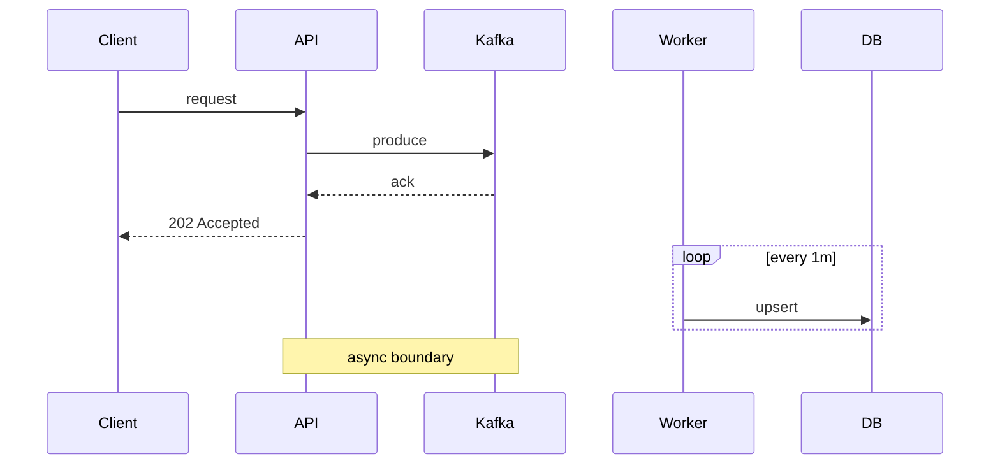
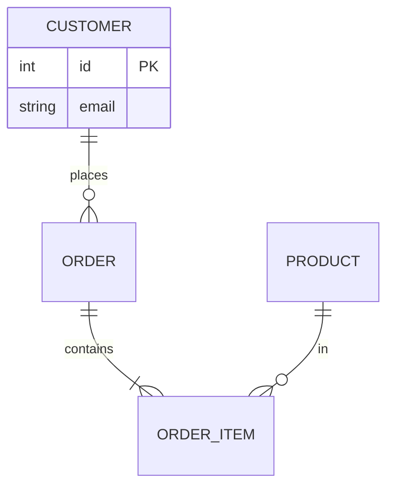
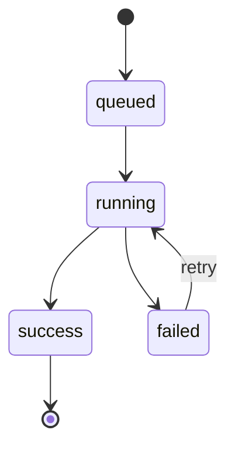
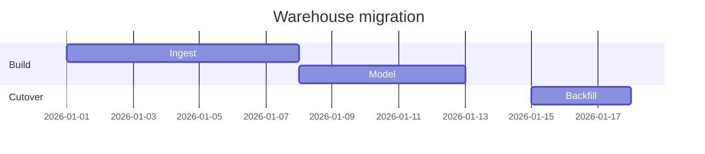
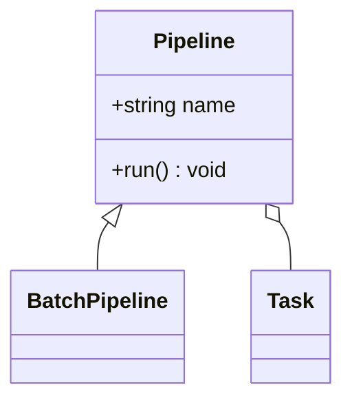

# Mermaid for data diagrams (sequence, ER, state, gantt) — the complete guide

A flowchart covers architecture and DAGs, but data engineers draw more than flows. Mermaid renders **most** of the diagram types from this track — sequence, ER, state, gantt (and class) — each from its own concise text syntax. So the entire diagram toolkit becomes diagrams-as-code, versioned beside your pipelines and docs.

@@diagram:dv-mermaid-types

## 1. Sequence diagrams

For behavior over time (who calls whom, in what order):

`->>` = a call (solid), `-->>` = a return/async (dashed). Add `loop`, `alt`/`else` (branches), `opt`, and `Note over A,B:`. This is the sequence diagram from the diagrams module, as code.

## 2. ER diagrams

For schemas and relationships, with crow's-foot cardinality inline:

`||` one, `|{` one-or-many, `o{` zero-or-many (the fork = many). You can list attributes with `PK`/`FK` markers inside the entity block — perfect for a data-contract doc.

## 3. State diagrams

For lifecycles (a job run, an order, a CDC record):

`[*]` marks start/terminal states; each `-->` is a transition (labeled if useful). A cycle here is fine — it's a lifecycle, not a pipeline DAG.

## 4. Gantt charts

For migration/project timelines:

Tasks have a start (`date` or `after taskId`) and a duration; sections group them.

## 5. Class diagrams (occasionally)

For object models (e.g. a pipeline framework):

`<|--` inheritance, `o--` aggregation, `*--` composition, `-->` association.

## 6. One tool for the whole toolkit

The architecture, ER, star, DAG, and sequence diagrams you learned to draw can **all** be written in Mermaid and committed to the repo — so your documentation is versioned, diffable, and consistent, instead of scattered across drawing tools.

## Gotchas

- **Wrong diagram-type header** — `sequenceDiagram` vs `flowchart`; the first line selects the parser.
- **Sequence solid/dashed mix-up** — `->>` is a call, `-->>` a return; swapping them misreads sync/async.
- **ER crow's-foot direction** — the fork is the *many* side; `||--o{` reads one-to-(zero-or-many).
- **State cycles vs DAG cycles** — a cycle is valid in a *state* diagram (lifecycle) but never in a *pipeline DAG*.
- **Gantt date format** — declare `dateFormat`; mismatched dates silently misplace bars.
- **Overusing class diagrams** — DEs rarely need code-level class diagrams; prefer ER/flowchart for data.

## Scenario — a data contract that can't drift

Your team formalizes a **data contract** for a source you ingest. Instead of a Confluence screenshot, the contract doc embeds a Mermaid **erDiagram** of the expected schema (entities, keys, crow's-foot relationships) and a Mermaid **stateDiagram** of the order lifecycle the pipeline assumes. Both live in the repo as text. When the upstream team adds a `RETURN` entity related to `ORDER`, the schema change and the ER-diagram edit land in the **same PR**; reviewers see the new relationship and its cardinality explicitly, catch that it's one-to-many (so downstream aggregations must account for it), and the contract stays a **single, versioned source of truth**. A design doc for the async ingestion path adds a Mermaid **sequenceDiagram** that makes the produce-before-commit ordering visible — the same race-condition analysis from the sequence-diagram lesson, now diffable in Git. Every diagram type the pipeline depends on is code, reviewed like code, and never silently wrong.

## Practice

1. What's the difference between `->>` and `-->>` in a Mermaid sequence diagram?
2. Write the Mermaid for "a CUSTOMER places zero-or-many ORDERs."
3. Why is a cycle acceptable in a state diagram but not in a pipeline DAG?
4. What does a gantt task's `after a1` mean?
5. Which Mermaid diagram type would you use for a job-run lifecycle, and why?
6. Name a case where a DE would reach for a class diagram (and why it's rare).
7. **(Design)** Write two Mermaid diagrams for a data contract: an `erDiagram` for USER, SUBSCRIPTION (many per user), and INVOICE (many per subscription) with keys; and a `stateDiagram-v2` for a subscription's lifecycle (trial → active → past_due → cancelled, with past_due able to return to active). Explain why keeping both as Mermaid strengthens the contract.
