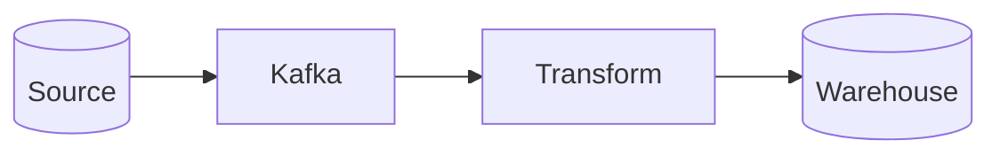
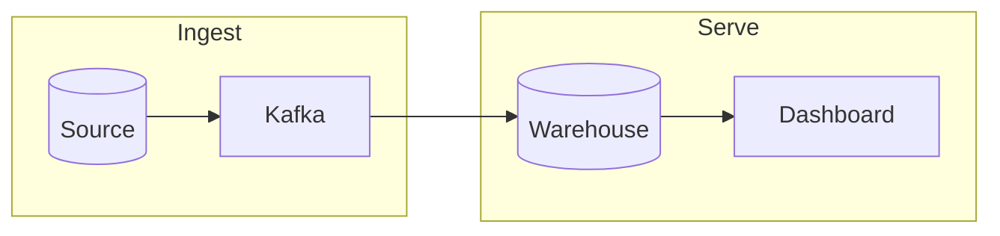

# Mermaid: diagrams as code (flowcharts) — the complete guide

Every diagram in the previous module — architecture, data flow, DAG — was a picture. **Mermaid** lets you write those pictures as **text** that renders to SVG automatically, so a diagram becomes a few lines you keep in Git next to the code it documents. No binary image to go stale, no drawing tool, and it shows up in PR diffs. This chapter covers the flowchart, the workhorse Mermaid diagram.

@@diagram:dv-mermaid-flow

## 1. Why diagrams-as-code

A diagram exported from a drawing tool is a **binary blob**: you can't diff it, it drifts from reality the moment someone forgets to re-export, and it lives apart from the code. A Mermaid diagram is **text**:

- **Versionable & diffable** — a PR shows exactly which nodes/edges changed.
- **Reviewable** — the diagram change rides in the same PR as the code change; a reviewer approves both together.
- **Zero-drift** — edit the text, and every place that renders it updates.
- **Portable** — the same block renders in GitHub, GitLab, Notion, docs sites, and this app.

## 2. Anatomy of a Mermaid block

You embed the diagram in a fenced code block whose language is `mermaid`:

The **first line** declares the diagram type and, for a flowchart, the **direction**: `TD`/`TB` (top-down), `LR` (left-right), `RL`, `BT`. Pick `LR` for pipelines and `TD` for hierarchies.

## 3. Node shapes (they carry meaning)

- `A[Rectangle]` — a process/service.
- `B(Rounded)` — a softer step/event.
- `C{Decision}` — a branch/condition.
- `D((Circle))` — a start/end or connector.
- `E[(Database)]` — a data store (cylinder) — use this for lakes/warehouses/queues.

Matching shape to meaning (rectangle = service, cylinder = store, diamond = decision) makes a flowchart read like the architecture diagrams from the last module.

## 4. Edge types and labels

- `A --> B` — arrow (directed).
- `A --- B` — line (no arrow).
- `A -.-> B` — dotted (e.g. async/optional).
- `A ==> B` — thick (emphasis).
- `A -->|yes| B` — a **labeled** edge; label branches (`yes`/`no`, `batch`/`stream`).

## 5. Subgraphs and styling

Group related nodes into zones with `subgraph`:

Style with `classDef` and `class`:

```mermaid
flowchart LR
  A[OK] --> B[Bad]
  classDef bad fill:#3d1f24,stroke:#ff6b6b;
  class B bad
```

Comments start with `%%`; `click A "url"` adds a hyperlink.

## 6. Where DEs use flowcharts

The **architecture**, **data-flow (DFD)**, and **pipeline DAG** diagrams from the previous module are all directed graphs — exactly what a Mermaid flowchart expresses. Kept in the repo README beside the pipeline, they're the living documentation that never drifts from the code.

## Gotchas

- **Wrong/absent direction** — forgetting `LR`/`TD` gives a cramped default; choose one and stay consistent.
- **Shapes with no meaning** — random shapes confuse; use cylinder for stores, diamond for decisions.
- **Unlabeled branches** — a `{decision}` with unlabeled edges hides which path is which; use `-->|yes|`.
- **One giant flowchart** — cramming a whole platform in is unreadable; split with subgraphs or separate diagrams (C4).
- **Reserved characters** — parentheses/quotes inside a label can break parsing; wrap the label text in quotes.
- **Static-site rendering** — some generators need a Mermaid plugin enabled; GitHub/GitLab render it natively.

## Scenario — the README that stays true

A team's ingestion pipeline README has a Mermaid flowchart: `Source DB -->|CDC| Kafka --> {valid?} -->|yes| Load` with a `-->|no| Quarantine` branch. When they add a deduplication step, the engineer edits **three lines** of the flowchart in the **same PR** that adds the dedup code. The reviewer sees the code and the updated diagram together, approves both, and GitHub re-renders the README instantly. Six months and forty PRs later, the diagram still matches the pipeline exactly — because it was never a separate artifact to forget. Contrast the team next door, whose Lucidchart PNG still shows the original three-box pipeline that shipped a year ago, misleading every new hire who reads it. Same effort up front; wildly different truth over time. That reliability is the whole argument for diagrams-as-code.

## Practice

1. What does the first line of a flowchart declare, and what does `LR` mean?
2. Give the Mermaid for a rectangle node, a decision node, and a database node.
3. How do you draw a labeled edge for a "yes" branch?
4. What does `subgraph ... end` do, and when would you use it?
5. Name two advantages of a Mermaid diagram over an exported PNG.
6. Why match node shape to meaning (cylinder, diamond, rectangle)?
7. **(Design)** Write a Mermaid flowchart for a lambda-style pipeline: a source feeds Kafka; Kafka feeds both a stream processor (to a serving DB → dashboard) and a lake (→ batch transform → warehouse → BI). Use subgraphs for the stream and batch paths, cylinder shapes for stores, and label the stream vs batch edges.
